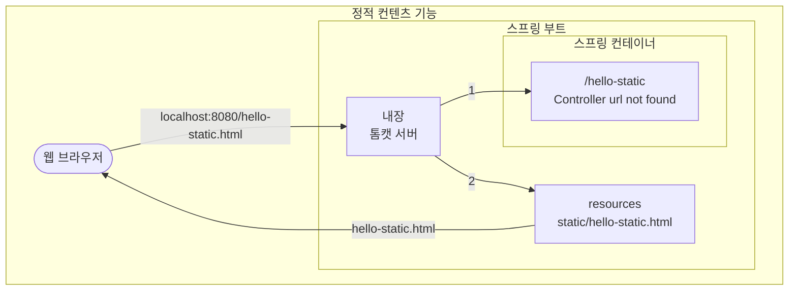
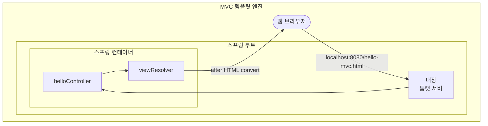
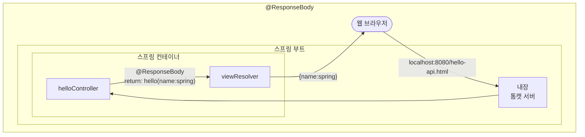
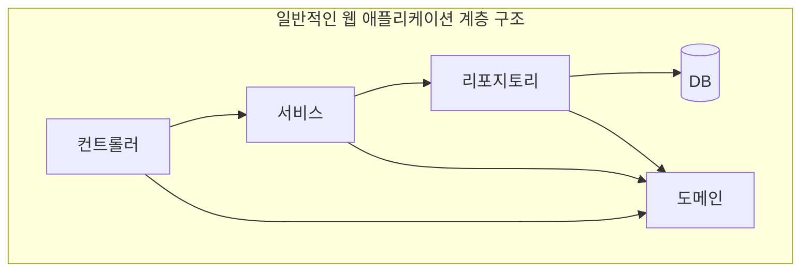
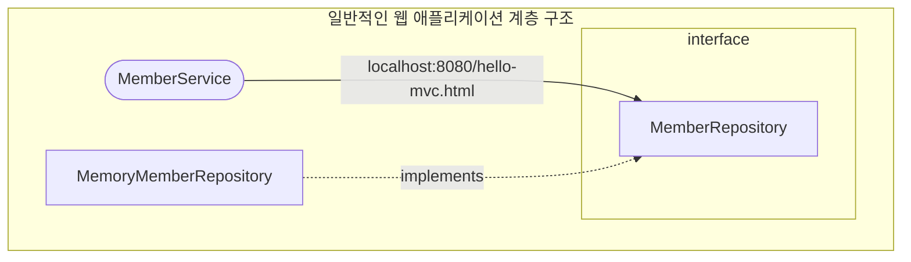
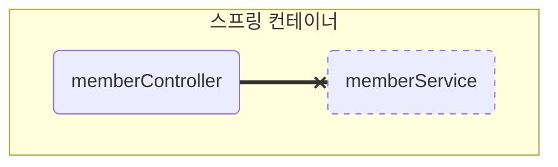
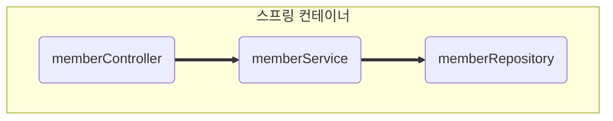
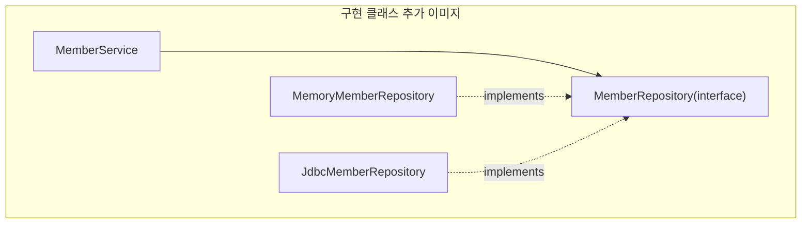
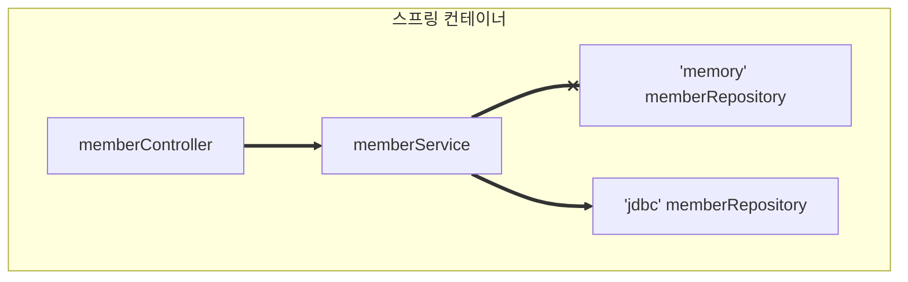

[프로젝트 환경설정](#프로젝트-환경설정)  
[스프링 웹 개발 기초](#스프링-웹-개발-기초)  
[회원 관리 예제 - 백엔드 개발](#회원-관리-예제---백엔드-개발)  
[스프링 빈과 의존관계](#스프링-빈과-의존관계)  
[회원 관리 예제 - 웹 MVC 개발](#회원-관리-예제---웹-MVC-개발)  
[스프링 DB 접근 기술](#스프링-DB-접근-기술)  
# 프로젝트 환경설정

## 1.View 환경 설정

### Welcome Page 만들기

* index.html
  1. static/index.html 을 올려두면
  [Welcome page](https://docs.spring.io/spring-boot/docs/current/reference/html/web.html#web.servlet.spring-mvc.welcome-page) 기능을 제공한다

### 템플릿 페이지
* HelloController.java
* hello.html
* 컨트롤러에서 리턴 값으로 문자를 반환하면, 뷰 리졸버( viewResolver )가 화면을 찾아서 처리한다.
  * 스프링 부트 템플릿엔진 기본 viewName 매핑
  * `resources:templates/` +{ViewName}+ `.html`

## 2.빌드하고 실행하기

### 콘솔로 이동
1. ./gradlew build
2. cd build/libs
3. java -jar hello-spring-0.0.1-SNAPSHOT.jar
4. 실행 확인
   * [IntelliJ Git bash default 적용](https://violetboralee.medium.com/intellij-idea%EC%99%80-git-bash-%EC%97%B0%EB%8F%99%ED%95%98%EA%B8%B0-63e8216aa7de)

# 스프링 웹 개발 기초

## 정적 컨텐츠
### 스프링 부트 정적 컨텐츠 기능
* [스프링 부트 정적 컨텐츠 문서](https://docs.spring.io/spring-boot/docs/current/reference/html/web.html#web.servlet.spring-mvc.static-content)
### 실행
* http://localhost:8080/hello-static.html
### 정적 컨텐츠 기능 flowchart


## MVC와 템플릿 엔진
### MVC
* Model, View, Controller
### 실행
* http://localhost:8080/hello-mvc?name=spring
### MVC flowchart

1. 웹 브라우저 => 스프링 부트(내장 톰캣 서버, 스프링 컨테이너, viewResolver)
    * http://localhost:8080/hello-mvc?name=spring
   1. 내장 톰캣 서버 => 
       * hello-mvc 관련 컨트롤러 색인, 존재
       * return hello-template
       * model(name:spring)
   2. 스프링 컨테이너 => viewResolver
       * hello-mvc 의 return templates/hello-template.html 에 Thymeleaf 템플릿 엔진 처리
2. 스프링 부트(viewResolver) => 웹 브라우저
    * `templates/hello-template.html`(Thymeleaf 템플릿 엔진 처리) 후 HTML 변환

## API

### @ResponseBody 문자 반환
* `@ResponseBody` 를 사용하면 뷰 리졸버`( viewResolver )`를 사용하지 않음
* 대신에 HTTP의 BODY에 문자 내용을 직접 반환(HTML BODY TAG를 말하는 것이 아님)

### 실행
* http://localhost:8080/hello-spring?name=spring

### @ResponseBody 객체 반환
* `@ResponseBody` 를 사용하고, 객체를 반환하면 객체가 JSON으로 변환됨

### 실행
* http://localhost:8080/hello-api?name=spring

### `@ResponseBody` flowchart

1. 웹 브라우저 => 내장 톰캣 서버
    * http://localhost:8080/hello-strng?name=spring
    * @ResponseBody return: hello spring
    * http://localhost:8080/hello-api?name=spring
    * @ResponseBody return: hello(name:spring)
2. 내장 톰캣 서버 => 스프링 컨테이너(helloController)
3. 스프링 컨테이너(helloController) => 스프링 컨테이너(HttpMessageConverter)
    * HttpMessageConverter  
      implements JsonConverter, StringConverter
4. 스프링 컨테이너(HttpMessageConverter) => 웹 브라우저
    * hello spring
    * {"name" : "spring"}

### `@ResponseBody` 사용 원리
* `@ResponseBody` 를 사용
* HTTP의 BODY에 문자 내용을 직접 반환
* `viewResolver` 대신에 `HttpMessageConverter` 가 동작
* 기본 문자처리: `StringHttpMessageConverter`
* 기본 객체처리: `MappingJackson2HttpMessageConverter`
* byte 처리 등등 기타 여러 `HttpMessageConverter`가 기본으로 등록되어 있음

> 참고: 클라이언트의 HTTP Accept 해더와 서버의 컨트롤러 반환 타입 정보 둘을 조합해서
HttpMessageConverter 가 선택된다.

# 회원 관리 예제 - 백엔드 개발

## 비즈니스 요구사항 정리

### 데이터
* 회원ID, 이름
### 기능
* 회원 등록, 조회
### 추가적 시나리오
* 아직 데이터 저장소가 선정되지 않음(가상의 시나리오)

## 일반적인 웹 애플리케이션 계층 구조

### Controller
* 웹 MVC 의 Controller 역할
### Service
* 서비스 핵심 기술 구현
### Repository
* 데이터베이스 접근, 도메인 객체를 DB 에 저장하고 관리
### Domain
* 비즈니스 도메인 객체
* 예) 회원, 주문, 쿠폰 등등 주로 데이터베이스에 저장하고 관리됨
### flowchart


## 클래스 의존관계

### 아직 데이터 저장소가 선정되지 않았음
* 우선 인터페이스로 구현 클래스를 변경할 수 있도록 설계 
### 데이터 저장소
* RDB, NoSQL 등등 다양한 저장소를 고민하고 있는 상황으로 가정
### 개발을 진행하기 위해서 초기 개발 단계
* 구현체로 가벼운 메모리 기반의 데이터 저장소를 사용
### flowchart 일반적인 웹 애플리케이션 계층 구조


## 회원 도메인과 리포지토리 만들기
### 회원 객체
* bean
### 회원 리포지토리 인터페이스
* repository interface
### 회원 리포지토리 메모리 구현체
* repository implements
* 동시성 문제가 고려되어있지 않음
* 실무에서는 ConcurrentHashMap, AtomicLong 사용 고려

## 회원 리포지토리 테스트 케이스 작성
* 개발한 기능을 실행해서 테스트 할 때 자바의 main 메서드를 통해서 실행하거나, 웹 애플리케이션의 컨트롤러를 통해서 해당 기능을 실행한다.
* 이러한 방법은 준비하고 실행하는데 오래 걸리고, 반복 실행하기 어렵고 여러 테스트를 한번에 실행하기 어렵다는 단점이 있다. 
* 자바는 JUnit이라는 프레임워크로 테스트를 실행해서 이러한 문제를 해결한다.
### 회원 리포지토리 메모리 구현체 테스트
* `src/test/java` 하위 폴더에 `MemoryMemberRepositoryTest` 를 생성한다.
* `@AfterEach`
  * 한번에 여러 테스트를 실행하면 메모리 DB에 직전 테스트의 결과가 남을 수 있다.
  * 이렇게 되면 다음 이전 테스트 때문에 다음 테스트가 실패할 가능성이 있다.
  * `@AfterEach` 를 사용하면 각 테스트가 종료될 때 마다 이 기능을 실행한다.
  * 여기서는 메모리 DB에 저장된 데이터를 삭제한다.
* 테스트는 각각 독립적으로 실행되어야 한다.
  * 테스트 순서에 의존관계가 있는 것은 좋은 테스트가 아니다.

## 회원 서비스 개발
* 회원가입
* 전체 회원 조회

## 회원 서비스 테스트
* 기존에는 회원 서비스가 메모리 회원 리포지토리를 직접 생성하게 했다.
* 회원 리포지토리의 코드가 **회원 서비스 코드를 DI 가능하게 변경한다.**
### `@BeforeEach`
* 각 테스트 실행 전에 호출된다. 
* 테스트가 서로 영향이 없도록 항상 새로운 객체를 생성하고, 의존관계도 새로 맺어준다.

# 스프링 빈과 의존관계

## 컴포넌트 스캔과 자동 의존관계 설정
* 회원 컨트롤러가 회원서비스와 회원 리포지토리를 사용할 수 있게 의존관계를 준비하자.
### 회원 컨트롤러에 의존관계 추가
* 생성자에 `@Autowired` 가 있으면 스프링이 연관된 객체를 스프링 컨테이너에서 찾아서 넣어준다.  
   이렇게 객체 의존관계를 외부에서 넣어주는 것을  DI(Dependency Injection), 의존성 주입이라 한다.
* 이전 테스트에서는 개발자가 직접 주입했고, 여기서는 `@Autowired` 에 의해 스프링이 주입해준다.
### 오류 발생
``` java
Consider defining a bean of type 'hello.hellospring.service.MemberService' in your configuration.
```
### memberService 가 스프링 빈으로 등록되어 있지 않다.
> 참고 : helloController 는 스프링이 제공하는 컨트롤러여서 스프링 빈으로 자동 등록된다.  
`@Controller` 가 있으면 자동 등록됨

### 스프링 빈을 등록하는 2가지 방법
* 컴포넌트 스캔과 **자동** 의존관계 설정
* 자바 코드로 **직접** 스프링 빈 등록하기
### 컴포넌트 스캔 원리
* `@Component` 애노테이션이 있으면 스프링 빈으로 자동 등록된다.
* `@Controller` 컨트롤러가 스프링 빈으로 자동 등록된 이유도 컴포넌트 스캔 때문이다.
* `@Component` 를 포함하는 다음 애노테이션도 스프링 빈으로 자동 등록된다.
  * `@Controller`
  * `@Service`
  * `@Repository`
### 회원 서비스 스프링 빈 등록
* `@Service`
> 참고 : 생성자에 `@Autowired` 를 사용하면 객체 생성 시접에 스프링 컨테이너에서 해당 스프링 빈을 찾아서 주입한다.  
생성자가 1개만 있으면 `@Autowired` 는 생략할 수 있다.
### 회원 리포지토리 스프링 빈 등록
* `@Repository`
### 스프링 빈 등록 이미지

* `memberService` 와 `memberRepository` 가 스프링 컨테이너에 스프링 빈으로 등록되었다.
> 참고 : 스프링은 스프링 컨테이너에 스프링 빈을 등록할 때, 기본으로 싱글톤으로 등록한다(유일하게 하나만 등록해서 공유한다)  
따라서 같은 스프링 빈이면 모두 같은 인스턴스다.  
설정으로 싱글톤이 아니게 설정할 수 있지만, 특별한 경우를 제외하면 대부분 싱글톤을 사용한다.

## 자바 코드로 직접 스프링 빈 등록하기
* 회원 서비스와 회원 리포지토리의 `@Service`, `@Repository`, `@Autowired` 애노테이션을 제거하고 진행한다.
* **여기서는 향후 메모리 리포지토리를 다른 리포지토리로 변경할 예정이므로, 컴포넌트 스캔 방식 대신에 자바 코드로 스프링 빈을 설정하겠다.**
> 참고: XML로 설정하는 방식도 있지만 최근에는 잘 사용하지 않으므로 생략한다.

> 참고: DI에는  
필드 주입,  
setter 주입,  
생성자 주입,  
이렇게 3가지 방법이 있다.  
의존관계가 실행중에 동적으로 변하는 경우는 거의 없으므로 **생성자 주입을 권장한다**.

> 참고: 실무에서는 주로 정형화된 컨트롤러, 서비스, 리포지토리 같은 코드는 컴포넌트 스캔을 사용한다.  
그리고 정형화되지 않거나, 상황에 따라 구현 클래스를 변경해야 하면 설정을 통해 스프링 반으로 등록한다.

> 주의: @Autowired 를 통한 DI 는 helloController, memberService 등과 같이 스프링이 관리하는 객체에서만 동작한다.    
스프링 빈으로 등록하지 않고 내가 직접 생성한 객체에서는 동작하지 않는다.

# 회원 관리 예제 - 웹 MVC 개발

## 회원 웹 기능 - 홈 화면 추가
* 홈 컨트롤러 추가
* 회원 관리용 홈
> 참고: 컨트롤러가 정적 파일보다 우선순위가 높다.

## 회원 웹 기능 - 등록
* 회원 등록 폼 컨트롤러
* 회원 등록 폼 HTML(resources/templates/members/createMemberForm)
* 회원 등록 컨트롤러

## 회원 웹 기능 - 조회
* 회원 컨트롤러에서 조회 기능
* 회원 리스트 HTML

# 스프링 DB 접근 기술

## H2 데이터베이스 설치
* 개발이나 테스트 용도로 가볍고 편리한 DB, 웹 화면 제공
> 주의  
> h2 데이터베이스는 꼭 다음 [링크](https://www.h2database.com/html/download-archive.html)에 들어가서 1.4.200 버전을 설치  
> 최근에 나온 2.0.206 버전을 설치하면 일부 기능이 정상 동작하지 않는다.  
> 만약 이미 설치후 실행까지 했다면 다시 설치후 ~/test.mv.db 파일을 삭제하고 실행한다.  
> General error: "The write format 1 is smaller than the supported format 2  
> [2.0.206/5]" [50000-202] HY000/50000

## 다운로드 및 설치
* [H2](https://www.h2database.com/html/main.html)
* h2 데이터베이스 버전은 스프링 부트 버전에 맞춘다.
* 권한 부여: `chmod 7555 h2.sh`(윈도우 사용자는 X)
* 실행: `./h2.sh`(윈도우 사용자는 `./h2.bat`)
* 데이터베이스 파일 생성 방법
  * `jdbc:h2:~/test`(최초 한번)
  * `~/test.mv.db` 파일 생성 확인
  * 이후 부터는 `jdbc:h2:tcp://localhost/~/test` 로 접속
## 테이블 생성하기
* 테이블 관리를 위해 프로젝트 루트에 sql/ddl.sql 파일 생성
* H2 데이터베이스에 접근해서 `member` 테이블 생성
### H2 데이터베이스가 정상 생성되지 않을 때
1. H2 데이터베이스를 종료하고, 다시 시작한다.
2. 웹 브라우저가 자동 실행되면 주소창에 다음과 같이 되어있다.(100.1.2.3이 아니라 임의의 숫자가 나온다.)
`http://100.1.2.3:8082/login.jsp?jsessionid=1b08453f853c758801baebacb013bfd1`
3. 다음과 같이 앞 부분만 `100.1.2.3` => `localhost` 로 변경하고 Enter를 입력한다. 나머지 부분은 절대 변경하면 안된다. (특히 뒤에 세션 부분이 변경되면 안된다.)
4. 데이터베이스 파일을 생성하면( `jdbc:h2:~/test` ), 데이터베이스가 정상 생성된다.

## 순수 Jdbc
### 환경 설정
* build.gradle 파일에 jdbc, h2 데이터베이스 관련 라이브러리 추가
* 스프링 부트 데이터베이스 연결 설정 추가
> 주의!: 스프링부트 2.4부터는 spring.datasource.username=sa 를 꼭 추가해주어야 한다.  
> 그렇지 않으면 Wrong user name or password 오류가 발생한다.  
> 참고로 다음과 같이 마지막에 공백이 들어가면 같은 오류가 발생한다.  
> spring.datasource.username=sa 공백 주의,  
> 공백은 모두 제거해야 한다.
### Jdbc 리포지토리 구현
* JdbcMemberRepository
> 주의! 이렇게 JDBC API로 직접 코딩하는 것은 20년 전 이야기이다. 참고만 할것.
* Jdbc 회원 리포지토리 구현
* 스프링 설정 변경
  * DataSource 는 데이터베이스 커넥션을 획득할 때 사용하는 객체다.
  * 스프링 부트는 데이터베이스 커넥션 정보를 바탕으로 DataSource 를 생성하고 스프링 빈으로 만들어ㅏ준다.
  * 그래서 DI를 받을 수 있다.
* 구현 클래스 추가 이미지

* 스프링 설정 이미지

* 개방 폐쇄 원칙(OCP; Open - Closed Principle)
  * 확장에는 열려있고, 수정에는 닫혀있다.
* 스프링의 DI(Dependencies Injection)을 사용하면 **기존 코드를 전혀 손대지 않고, 설정만으로 구현 클래스를 변경**할 수 있다.
* 회원을 등록하고 DB 에 결과가 잘 입력되는지 확인하자.
* 데이터를 DB 에 저장하므로 스프링 서버를 다시 실행해도 데이터가 안전하게 저장된다.

## 스프링 통합 테스트
* 스프링 컨테이너와 DB까지 연결한 통합 테스트를 진행해보자.
### 회원 서비스 스프링 통합 테스트
* `@SpringBootTest`
  * 스프링 컨테이너와 테스트를 함께 실행한다
* `@Transactional`
  * 테스트 케이스에 이 애노테이션이 있으면, 테스트 시작 전에 트랜잭션을 시작하고, 테스트 완료 후에 항상 롤백한다.
  * 이렇게 하면 DB에 데이터가 남지 않으므로 다음 테스트에 영향을 주지 않는다.
  * 물론, JUnit 이 아닐 경우에 `@Transactional` 을 붙이게 되면 rollback 되지 않고 transaction 단위로 commit 이 진행된다.
> 참고; `@Transactional` test 에서 사용될 경우, 서비스 로직에서 사용될 경우  
> [https://tecoble.techcourse.co.kr/post/2021-05-25-transactional/](https://tecoble.techcourse.co.kr/post/2021-05-25-transactional/)  
> [https://me-analyzingdata.tistory.com/entry/SpringTransactional%EA%B3%BC-JUnit-Test](https://me-analyzingdata.tistory.com/entry/SpringTransactional%EA%B3%BC-JUnit-Test)

## 스프링 JdbcTemplate
* 순수 Jdbc 와 동일한 환경설정을 하면 된다.
* 스프링 JdbcTemplate 과 MyBatis 같은 라이브러리는 JDBC API 에서 본 반복 코드를 대부분 제거해 준다.
* 하지만 SQL 은 직접 작성해야 한다.
> 참고; 디자인 패턴중 template method 라는 pattern 이 있는데,  
> template method pattern 을 많이 활용하여 코드를 줄였기 때문에 이름을 이렇게 지었다.
### 스프링 JdbcTemplate 회원 리포지토리 생성
* JdbcTemplateMemberRepository
> 참고; 생성자가 딱 1개만 있고, 스프링 bean 에 등록되면, `@Autowired` 생략해도 된다.
### JdbcTemplate 을 사용하도록 스프링 설정 변경
* SpringConfig